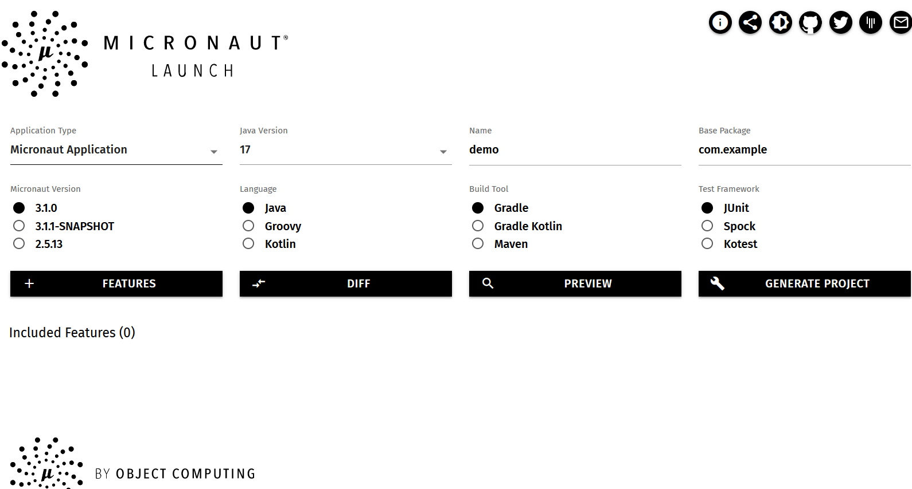

# Building Restful APIs with Micronaut

Similar to Spring Boot, Micronaut is a JVM based framework and designated for building Microservice and cloud native applications.

Unlike Spring Boot, Micronaut process IOC at compile time and erases runtime reflection, so it is easier to build native image. 

> Spring also started a Spring native project, but it is in the early stage.

For developers that new to Micronaut, it is easy to develop your applications using Micronaut if you have some knowledge of  Spring Boot. In this post, I will share my experience to create a simple Restful API application from scratch using Micronaut from a Spring developer view.

## Generating project skeleton

Similar to [Spring Initializr]( https://start.spring.io), Micronaut provides an online service named **Launch** to help your generate a project skeleton.

Open your browser, go to [Micronaut Launch](https://micronaut.io/launch/), you will see the following screen.



In the **Java version** field, select the latest LTS version **17**.  Then click the **Features** button, add *lombok*, *data hibernate jpa*, *assertj*, *postgres*, *testcontainers*. Finally, hit the **GENERATE PROJECT** button to produce the project files into an archive for download.

Extract the project files into disk, and import to your IDE.  

> You can also create a Micronaut project using Micronaut CLI, check [Micronaut Starter documentation](https://micronaut-projects.github.io/micronaut-starter/latest/guide/#installation).

## Exploring project structure

Let's have a look at the files in the project.

```bash
.
├── build.gradle
├── gradle
│   └── wrapper
│       ├── gradle-wrapper.jar
│       └── gradle-wrapper.properties
├── gradle.properties
├── gradlew
├── gradlew.bat
├── micronaut-cli.yml
├── settings.gradle
└── src
    ├── main
    │   ├── java
    │   │   └── com
    │   │       └── example
    │   │           └── Application.java
    │   └── resources
    │       ├── application.yml
    │       └── logback.xml
    └── test
        ├── java
        │   └── com
        │       └── example
        │           └── DemoTest.java
        └── resources
            ├── application-test.yml
            └── logback-test.xml
```

Besides Gradle build scripts related resources, it is similar to the Spring Boot project structure. 

* The `Application` is the entry class of the application.
* The *src/main/resources/application.yml* is the application configuration.
* The  *src/main/resources/logback.xml*  is logging configuration.
* The `DemoTest` is an example of using `@MicronautTest`. 
* Under the *src/test/resources* folder, there are some config resources for test purpose.

Let's have a look at *build.gradle*.

It uses `com.github.johnrengelman.shadow` to package the application into a jar archive.  The `micronaut` plugin will process the dependency injection at compile time via Java Compiler Annotation Processors. This plugin also includes other tasks, such building application into Docker image and GraalVM native image.

## Declaring a Bean

In Micronaut, it used  JSR330(aka @Inject) specification to annotate the injectable beans. JSR330 originally is lead by SpringSource(now VMware) and Google. 

> Spring also has built-in JSR330 support, by default it is not activated. You should add `inject` artifact in your project dependencies to enable it.

When a class is annotated with `@Singleton` means there is only one instance shared in the application scope, `@Prototype` will produce a new instance for every injection.

Micronaut provides a `@Factory` to produces simple beans in groups, for example.

```java
@Factory
class MyConfig{
    
    @Singleton
    public Foo foo(){}
    
    @Singleton
    public Bar bar(){}
}
```

As described in former sections,  Micronaut process IOC at compile time. When building the application,  explore the project *build/classes* folder, you will find there are a lot of extra classes generated at compile time which names are start with a USD("**$**") symbol.

## Setup database

Open *src/main/resources/application.yml*, the `datasources` is configured when generating the project.  Change the properties according to your environment.

```yaml
datasources:
  default:
    url: jdbc:postgresql://localhost:5432/blogdb
    driverClassName: org.postgresql.Driver
    username: user
    password: password
    schema-generate: CREATE_DROP
    dialect: POSTGRES
jpa.default.properties.hibernate.hbm2ddl.auto: update
```

Create a docker compose file to bootstrap Postgres in docker container.

```yaml
version: '3.7' # specify docker-compose version

services:
  postgres:
    image: postgres
    ports:
      - "5432:5432"
    restart: always
    environment:
      POSTGRES_PASSWORD: password
      POSTGRES_DB: blogdb
      POSTGRES_USER: user
    volumes:
      - ./data:/var/lib/postgresql
      - ./pg-initdb.d:/docker-entrypoint-initdb.d
```

Start up Postgres database.

```bash
docker compose up postgres
```

## Data Accessing with Micronaut Data

We added *data-jpa* feature when generating the project, which enables Micronaut data support. If you have experience of Spring Data JPA , it is easy to migrate to Micronaut Data.

I have used a simple blog application in the former examples when demonstrating other frameworks. In this post, I will reuse the blog application concept.  

Basically it includes two JPA entities, `Post` and `Comment`, it is a `OneToMany` relation.

```java
@Getter
@Setter
@NoArgsConstructor
@AllArgsConstructor
@Builder
@Entity
@Table(name = "posts")
public class Post implements Serializable {

    @Id
    @GeneratedValue(generator = "uuid")
    @GenericGenerator(name = "uuid", strategy = "uuid2")
    UUID id;
    String title;
    String content;

    @Builder.Default
    Status status = Status.DRAFT;

    @Builder.Default
    LocalDateTime createdAt = LocalDateTime.now();

    @OneToMany(cascade = {CascadeType.ALL}, orphanRemoval = true, mappedBy = "post")
    @Builder.Default
    @OrderColumn(name = "comment_idx")
    List<Comment> comments = new ArrayList<>();

    @Override
    public boolean equals(Object o) {
        if (this == o) return true;
        if (o == null || getClass() != o.getClass()) return false;
        Post post = (Post) o;
        return getTitle().equals(post.getTitle());
    }

    @Override
    public int hashCode() {
        return Objects.hash(getTitle());
    }

    @Override
    public String toString() {
        return "Post{" +
                "id=" + id +
                ", title='" + title + '\'' +
                ", content='" + content + '\'' +
                ", status=" + status +
                ", createdAt=" + createdAt +
                '}';
    }
}

// Comment entity 
@Getter
@Setter
@NoArgsConstructor
@AllArgsConstructor
@Builder
@Entity
@Table(name = "comments")
public class Comment implements Serializable {

    @Id
    @GeneratedValue(generator = "uuid")
    @GenericGenerator(name = "uuid", strategy = "uuid2")
    private UUID id;

    @ManyToOne
    @JoinColumn(name = "post_id")
    private Post post;

    private String content;

    @Builder.Default
    @Column(name = "created_at")
    private LocalDateTime createdAt = LocalDateTime.now();

    @Override
    public boolean equals(Object o) {
        if (this == o) return true;
        if (o == null || getClass() != o.getClass()) return false;
        Comment comment = (Comment) o;
        return getContent().equals(comment.getContent());
    }

    @Override
    public int hashCode() {
        return Objects.hash(getContent());
    }

    @Override
    public String toString() {
        return "Comment{" +
                "id=" + id +
                ", content='" + content + '\'' +
                ", createdAt=" + createdAt +
                '}';
    }
}

```

They are standard JPA `@Entity` classes.  

An JPA entity class should be annotated with an `@Entity` annotation, and includes a `@Id` field to identify this entity and a none-arguments constructor. Here we use Lombok to generate setters and getters, and constructors at compile time. We use IDE to generate `equals` and `hasCode` according to the business requirements.  

```java
@Repository
public interface PostRepository extends JpaRepository<Post, UUID>{

}

@Repository
public interface CommentRepository extends JpaRepository<Comment, UUID> {

    List<Comment> findByPost(Post post);
}
```

Add a `DataInitializer` bean to initialize some sample data.

```java
@Singleton
@RequiredArgsConstructor
@Slf4j
public class DataInitializer implements ApplicationEventListener<ApplicationStartupEvent> {
    private final PostRepository posts;

    private final TransactionOperations<?> tx;

    @Override
    public void onApplicationEvent(ApplicationStartupEvent event) {
        log.info("initializing sample data...");
        var data = List.of(Post.builder().title("Getting started wit Micronaut").content("test").build(),
                Post.builder().title("Getting started wit Micronaut: part 2").content("test").build());
        tx.executeWrite(status -> {
            this.posts.deleteAll();
            this.posts.saveAll(data);
            return null;
        });
        tx.executeRead(status -> {
            this.posts.findAll().forEach(p -> log.info("saved post: {}", p));
            return null;
        });
        log.info("data initialization is done...");
    }
}
```


Write a test to verify functionality of `PostRepository`. Similar to the `@SpringBootTest`, Micronaut provides a `@MicronautTest`. 

```java
@MicronautTest(application = Application.class, startApplication = false)
class PostRepositoryTest {

    @Inject
    PostRepository posts;

    @PersistenceContext
    EntityManager entityManager;

    @Test
    void testCreatePost() {
        var entity = Post.builder().title("test title").content("test content").build();
        this.entityManager.persist(entity);

        assertThat(entity.getId()).isNotNull();
        assertTrue(posts.findById(entity.getId()).isPresent());
    }

}
```

Here we set `startApplication = false`, it does not start the embedded server to host the application, to test against the database, we do not need a running application

We have add `testcontainers` feature, it will configure a Postgres for test automatically.  Check the testcontainers config in the `src/test/resources/application-test.yml`.

```java
datasources:
  default:
    url: jdbc:tc:postgresql:12:///postgres
    driverClassName: org.testcontainers.jdbc.ContainerDatabaseDriver
```

When there is a `tc` as database host name, testcontainer will start up a Postgres database automaticially.

## Exposing Restful APIs

Similar to Spring WebMVC, in Micronaut,  we can use a controller to expose Restful APIs. 

```java
@Controller("/posts")
@RequiredArgsConstructor(onConstructor_ = {@Inject})
@Validated
public class PostController {
    private final PostRepository posts;
    private final CommentRepository comments;

    @Get(uri = "/", produces = MediaType.APPLICATION_JSON)
    public HttpResponse<List<PostSummaryDto>> getAll() {
        var body = posts.findAll()
                .stream()
                .map(p -> new PostSummaryDto(p.getId(), p.getTitle(), p.getCreatedAt()))
                .toList();
        return ok(body);
    }

    @Get(uri = "/{id}", produces = MediaType.APPLICATION_JSON)
    public HttpResponse<?> getById(@PathVariable UUID id) {
        return posts.findById(id)
                .map(p -> ok(new PostDetailsDto(p.getId(), p.getTitle(), p.getContent(), p.getStatus(), p.getCreatedAt())))
                //.orElseThrow(() -> new PostNotFoundException(id));
        .orElseGet(HttpResponse::notFound);
    }
}
```

A controller is annotated with `@Controller`, you can set a base `uri` that can be applied on all methods.  The `@Get`, `@Post`,`@Put`, `@Delete` is mapped to handle varied HTTP methods, it is similar to the Spring's `@GetMapping`, `@PostMapping`, etc.  You can set media types using *consumes* or *produces*  attributes in these annotations to limit the request and response content type, or use standalone annotations `@Consumes` and `@Produces` to set up the media types.

Start up  the application via Gradle command.

```bash 
./gradlew run
```

> Do not forget  to start up Postgres firstly.

Use `curl` to test the `/posts` endpoint.

```bash
curl http://localhost:8080/posts
[ {
  "id" : "b6fb90ab-2719-498e-a5fd-93d0c7669fdf",
  "title" : "Getting started wit Micronaut",
  "createdAt" : "2021-10-14T22:00:28.80933"
}, {
  "id" : "8c6147ea-8de4-473f-b97d-e211c8e43bac",
  "title" : "Getting started wit Micronaut: part 2",
  "createdAt" : "2021-10-14T22:00:28.80933"
} ]
```


```bash
curl http://localhost:8080/posts/b6fb90ab-2719-498e-a5fd-93d0c7669fdf
 {
  "id" : "b6fb90ab-2719-498e-a5fd-93d0c7669fdf",
  "title" : "Getting started wit Micronaut",
  "content": "test",
  "createdAt" : "2021-10-14T22:00:28.80933"
}
```

> Micronaut CLI provides commands to generate controller, bean, etc.  Run `mn --help` to get all available commands.

Write a test for the `PostController`. 

```java
@MicronautTest(environments = Environment.TEST)
public class PostControllerTest {

    @Inject
    @Client("/")
    HttpClient client;

    @Inject
    PostRepository posts;

    @Inject
    CommentRepository comments;

    @MockBean(PostRepository.class)
    PostRepository posts() {
        return mock(PostRepository.class);
    }

    @MockBean(CommentRepository.class)
    CommentRepository comments() {
        return mock(CommentRepository.class);
    }

    @Test
    @DisplayName("test GET '/posts' endpoint")
    public void testGetAllPosts() throws Exception {
        when(this.posts.findAll()).thenReturn(
                List.of(Post.builder().id(UUID.randomUUID()).title("test title").content("test content").build())
        );
        var response = client.toBlocking().exchange("/posts", PostSummaryDto[].class);
        assertEquals(HttpStatus.OK, response.status());
        var body = response.body();
        assertThat(body.length).isEqualTo(1);
        assertThat(body[0].title()).isEqualTo("test title");

        verify(this.posts, times(1)).findAll();
        verifyNoMoreInteractions(this.posts);
    }

    @Test
    @DisplayName("test GET '/posts/{id}' endpoint")
    public void testGetSinglePost() throws Exception {
        when(this.posts.findById(any(UUID.class))).thenReturn(
                Optional.ofNullable(Post.builder().id(UUID.randomUUID()).title("test title").content("test content").build())
        );
        var request = HttpRequest.GET(UriBuilder.of("/posts/{id}").expand(Map.of("id", UUID.randomUUID())));
        var response = client.toBlocking().exchange(request, PostDetailsDto.class);
        assertEquals(HttpStatus.OK, response.status());
        var body = response.body();
        assertThat(body.title()).isEqualTo("test title");

        verify(this.posts, times(1)).findById(any(UUID.class));
        verifyNoMoreInteractions(this.posts);
    }

    @Test
    @DisplayName("test GET '/posts/{id}' endpoint that does not exist")
    public void testGetSinglePost_notFound() throws Exception {
        when(this.posts.findById(any(UUID.class))).thenReturn(Optional.ofNullable(null));
        var request = HttpRequest.GET(UriBuilder.of("/posts/{id}").expand(Map.of("id", UUID.randomUUID())));
        var exception = assertThrows(HttpClientResponseException.class, () -> client.toBlocking().exchange(request, PostDetailsDto.class));

        assertEquals(HttpStatus.NOT_FOUND, exception.getStatus());
        verify(this.posts, times(1)).findById(any(UUID.class));
        verifyNoMoreInteractions(this.posts);
    }
}
```

In this test, we use Mockito to mock all dependent beans(`PostRepository` and `CommentRepository`) in the `PostController`.  To mock beans in the test context, Micronaut provides a `MockBean` to produce a mocked instance to replace the *real* beans.

Similar to Spring's `RestTemplate` or `WebClient`,  Micronaut provides a `HttpClient` to send request to a certain URI, by default it uses the *ReactiveStream*s compatible API, If you are stick on the traditional blocking API, call the `toBlocking()` method to switch to use it. 

The `exchange` method will return a HTTP response object, and the `retrieve` method returns the response body directly.

> Note: When using blocking APIs, if it returns a failure HTTP response, such as return a 4xx status code,  it will throws a `HttpClientResponseException` instead. In contrast,  in ReactiveStreams APIs, it will emit the exception to error channel.

### Exception Handling

In the above `PostController`, if there is no posts found for the given post id, it returns a 404 HTTP status directly.  In a real world application, we can use an exception to envelope the exception case. Like Spring WebMVC, Micronaut also provides exception handling mechanism. 

For example, create an `PostNotFoundException` to stand for the case post was not found by id.

Create a `PostNotFoundException` class. 

```java
public class PostNotFoundException extends RuntimeException {
    public PostNotFoundException(UUID id) {
        super("Post[id=" + id + "] was not found");
    }
}
```

In the `PostController`, throw the exception.

```java
@Get(uri = "/{id}", produces = MediaType.APPLICATION_JSON)
public HttpResponse<?> getById(@PathVariable UUID id) {
    return posts.findById(id)
        .map(p -> ok(new PostDetailsDto(p.getId(), p.getTitle(), p.getContent(), p.getStatus(), p.getCreatedAt())))
        .orElseThrow(() -> new PostNotFoundException(id));
}
```

Add a `PostNotFoundExceptionHandler` to handle `PostNotFoundException`.

```java
@Produces
@Singleton
@Requires(classes = { PostNotFoundException.class})
@RequiredArgsConstructor
public class PostNotFoundExceptionHandler implements ExceptionHandler<PostNotFoundException, HttpResponse<?>> {
    private final ErrorResponseProcessor<?> errorResponseProcessor;

    @Override
    public HttpResponse<?> handle(HttpRequest request, PostNotFoundException exception) {
        return errorResponseProcessor.processResponse(
                ErrorContext.builder(request)
                        .cause(exception)
                        .errorMessage(exception.getMessage())
                        .build(),
                HttpResponse.notFound()
        );
    }
}
```

Open your terminal,  use `curl` to test the `/posts/{id}` endpoint with an none-existing id.

```bash
# curl http://localhost:8080/posts/b6fb90ab-2719-498e-a5fd-93d0c7669fdf -v
> GET /posts/b6fb90ab-2719-498e-a5fd-93d0c7669fdf HTTP/1.1
> Host: localhost:8080
> User-Agent: curl/7.55.1
> Accept: */*
>
< HTTP/1.1 404 Not Found
< Content-Type: application/json
< date: Mon, 25 Oct 2021 07:02:01 GMT
< content-length: 301
< connection: keep-alive
<
{
  "message" : "Not Found",
  "_links" : {
    "self" : {
      "href" : "/posts/b6fb90ab-2719-498e-a5fd-93d0c7669fdf",
      "templated" : false
    }
  },
  "_embedded" : {
    "errors" : [ {
      "message" : "Post[id=b6fb90ab-2719-498e-a5fd-93d0c7669fdf] was not found"
    } ]
  }
}
```

### Pagination

Similar to Spring Data, Micronaut Data provides pagination for long query result, the `findAll` accepts a `Pageable` parameter, and returns a `Page` result. Micronaut Data also includes a `Specification`  to adopt JPA Criteria APIs for type safe query.

Change `PostRepository`  , add `JpaSpecificationExecutor<Post>` to extends list.

```java
@Repository
public interface PostRepository extends JpaRepository<Post, UUID>, JpaSpecificationExecutor<Post> {

}
```

Create a specific `PostSpecifications` to group all specifications for querying posts.  Currently only add one for query by keyword and status.

```java
public class PostSpecifications {
    private PostSpecifications(){
        // forbid to instantiate
    }

    public static Specification<Post> filterByKeywordAndStatus(
            final String keyword,
            final Status status
    ) {
        return (Root<Post> root, CriteriaQuery<?> query, CriteriaBuilder cb) -> {
            List<Predicate> predicates = new ArrayList<>();
            if (StringUtils.hasText(keyword)) {
                predicates.add(
                        cb.or(
                                cb.like(root.get(Post_.title), "%" + keyword + "%"),
                                cb.like(root.get(Post_.content), "%" + keyword + "%")
                        )
                );
            }

            if (status != null) {
                predicates.add(cb.equal(root.get(Post_.status), status));
            }

            return cb.and(predicates.toArray(new Predicate[0]));
        };
    }
}
```

Change the `getAll` method of `PostController` to the following.

```java
@Get(uri = "/", produces = MediaType.APPLICATION_JSON)
@Transactional
public HttpResponse<Page<PostSummaryDto>> getAll(@QueryValue(defaultValue = "") String q,
                                                 @QueryValue(defaultValue = "") String status,
                                                 @QueryValue(defaultValue = "0") int page,
                                                 @QueryValue(defaultValue = "10") int size) {
    var pageable = Pageable.from(page, size, Sort.of(Sort.Order.desc("createdAt")));
    var postStatus = StringUtils.hasText(status) ? com.example.domain.Status.valueOf(status) : null;
    var data = this.posts.findAll(PostSpecifications.filterByKeywordAndStatus(q, postStatus), pageable);
    var body = data.map(p -> new PostSummaryDto(p.getId(), p.getTitle(), p.getCreatedAt()));
    return ok(body);
}
```

All the query parameters are optional. 

Let's use `curl` to test the */posts* endpiont.

```bash
# curl http://localhost:8080/posts
{
  "content" : [ {
    "id" : "c9ec963d-2df5-4d65-bfbe-5a0d4cb14ca6",
    "title" : "Getting started wit Micronaut",
    "createdAt" : "2021-10-25T16:35:03.732951"
  }, {
    "id" : "0a79185c-5981-4301-86d1-c266b26b4980",
    "title" : "Getting started wit Micronaut: part 2",
    "createdAt" : "2021-10-25T16:35:03.732951"
  } ],
  "pageable" : {
    "number" : 0,
    "sort" : {
      "orderBy" : [ {
        "property" : "createdAt",
        "direction" : "DESC",
        "ignoreCase" : false,
        "ascending" : false
      } ],
      "sorted" : true
    },
    "size" : 10,
    "offset" : 0,
    "sorted" : true,
    "unpaged" : false
  },
  "totalSize" : 2,
  "totalPages" : 1,
  "empty" : false,
  "size" : 10,
  "offset" : 0,
  "numberOfElements" : 2,
  "pageNumber" : 0
}
```

### Customizing JsonSerializer

The `Page` object rendered result is a little tedious, most of case, we do not need all these fields, we can customize it via Jackson `JsonSerializer`. 

```java
@Singleton
public class PageJsonSerializer extends JsonSerializer<Page<?>> {
    @Override
    public void serialize(Page<?> value, JsonGenerator gen, SerializerProvider serializers) throws IOException {
        gen.writeStartObject();
        gen.writeNumberField("pageNumber", value.getPageNumber());
        if (value.getNumberOfElements() != value.getSize()) {
            //only display it in the last page when number of elements is not equal to page size.
            gen.writeNumberField("numberOfElements", value.getNumberOfElements());
        }
        gen.writeNumberField("size", value.getSize());
        gen.writeNumberField("totalPages", value.getTotalPages());
        gen.writeNumberField("totalSize", value.getTotalSize());
        gen.writeObjectField("content", value.getContent());
        gen.writeEndObject();
    }
}

```

Run the application again, and hint  */posts* endpoint.

```bash
# curl http://localhost:8080/posts
{
  "pageNumber" : 0,
  "numberOfElements" : 2,
  "size" : 10,
  "totalPages" : 1,
  "totalSize" : 2,
  "content" : [ {
    "id" : "53fb77d5-4159-4a80-bab9-c76d9a535b36",
    "title" : "Getting started wit Micronaut",
    "createdAt" : "2021-10-25T16:47:05.545594"
  }, {
    "id" : "aa02fd49-0c24-4f12-b204-2e48213c7a1e",
    "title" : "Getting started wit Micronaut: part 2",
    "createdAt" : "2021-10-25T16:47:05.545594"
  } ]
}
```

Modify the testing codes to verify changes.

```java
class PostControllerTest{
    //...
    
    @Test
    @DisplayName("test GET '/posts' endpoint")
    public void testGetAllPosts() throws Exception {
        var content = List.of(Post.builder().id(UUID.randomUUID()).title("test title").content("test content").build());
        when(this.posts.findAll(isA(Specification.class), isA(Pageable.class))).thenReturn(
                Page.of(content, Pageable.from(0, 20), 1)
        );
        var request = HttpRequest.GET("/posts");
        var response = client.toBlocking().exchange(request, String.class);
        assertEquals(HttpStatus.OK, response.status());
        var body = response.body();
        assertThat(JsonPath.from(body).getInt("totalSize")).isEqualTo(1);
        assertThat(JsonPath.from(body).getString("content[0].title")).isEqualTo("test title");

        verify(this.posts, times(1)).findAll(isA(Specification.class), isA(Pageable.class));
        verifyNoMoreInteractions(this.posts);
    }
}
```

## Creating Posts

 We have discussed how to query posts by key word and get single post by id,  in this section, we will focus on creating a new post.

According the REST convention, we will use a POST HTTP method  to send a request on endpoint */posts* and accept JSON data as request body. 

```
@io.micronaut.http.annotation.Post(uri = "/", consumes = MediaType.APPLICATION_JSON)
@Transactional
public HttpResponse<Void> create(@Body CreatePostCommand dto) {
    var data = Post.builder().title(dto.title()).content(dto.content()).build();
    var saved = this.posts.save(data);
    return HttpResponse.created(URI.create("/posts/" + saved.getId()));
}
```

The request body is deserialized as a POJO by built-in Jackson `JsonDesearilizer`s, it is annotated with a `@Body` annotation to indicate which target class it will be desearilized to.  After the post data is saved, set the response header `Location` to the URI of accessing the new post.

Run the application, and try to add a post via `curl`, and then access the newly created post.

```bash
# curl -X POST -v  -H "Content-Type:application/json" http://localhost:8080/posts -d "{\"title\":\"test title\",\"content\":\"test content\"}"
> POST /posts HTTP/1.1
> Host: localhost:8080
> User-Agent: curl/7.55.1
> Accept: */*
> Content-Type:application/json
> Content-Length: 47
>
* upload completely sent off: 47 out of 47 bytes
< HTTP/1.1 201 Created
< location: /posts/7db15639-62e3-4d3e-9cf4-f54413502ea6
< date: Mon, 25 Oct 2021 09:07:40 GMT
< connection: keep-alive
< transfer-encoding: chunked
<
# curl http://localhost:8080/posts/7db15639-62e3-4d3e-9cf4-f54413502ea6
{
  "id" : "7db15639-62e3-4d3e-9cf4-f54413502ea6",
  "title" : "test title",
  "content" : "test content",
  "status" : "DRAFT",
  "createdAt" : "2021-10-25T17:07:40.87621"
}
```

### Data Validation

Generally, in a real application, we have to ensure the request data satisfies requirements. Micronaut has built-in Bean Validation support.

In the above `CreatPostCommand` class, add Bean Validation annotations on the fields.

```java
@Introspected
public record CreatePostCommand(@NotBlank String title, @NotBlank String content) {
}
```

You have to add `@Introspected` annotation to let micronaut plugin to preprocess bean validation annotations at compile time, and let Bean Validation works without any reflections APIs at runtime time.

In the  `PostController`, add a `@Validated` on the class and a `@Valid` on the method argument.

```java
@Validated
public class PostController {
    public HttpResponse<Void> create(@Body @Valid CreatePostCommand dto) {...}
    //...
}
```

Let's  try to create a post.  Note, set  the `content` field empty.

```bash
curl -X POST -v  -H "Content-Type:application/json" http://localhost:8080/posts -d "{\"title\":\"test title\",\"content\":\"\"}"
> POST /posts HTTP/1.1
> Host: localhost:8080
> User-Agent: curl/7.55.1
> Accept: */*
> Content-Type:application/json
> Content-Length: 35
>
* upload completely sent off: 35 out of 35 bytes
< HTTP/1.1 400 Bad Request
< Content-Type: application/json
< date: Mon, 25 Oct 2021 09:23:22 GMT
< content-length: 237
< connection: keep-alive
<
{
  "message" : "Bad Request",
  "_embedded" : {
    "errors" : [ {
      "message" : "dto.content: must not be blank"
    } ]
  },
  "_links" : {
    "self" : {
      "href" : "/posts",
      "templated" : false
    }
  }
}
```

## Deleting a Post

According to REST convention, to delete a single post, send a `DELETE` request on `/posts/{id}`, if it is successful, returns a 204 status. If the `id` is not existed, returns a `404` instead.

Add the following codes to the `PostController`.

```java
@Delete(uri = "/{id}", produces = MediaType.APPLICATION_JSON)
@Transactional
public HttpResponse<?> deleteById(@PathVariable UUID id) {
    return posts.findById(id)
        .map(p -> {
            this.posts.delete(p);
            return HttpResponse.noContent();
        })
        .orElseThrow(() -> new PostNotFoundException(id));
    //.orElseGet(HttpResponse::notFound);
}
```

## Processing Subresources

In our application, the a `Comment` resource, it should be a subresource of `Post` resource when adding comments or fetching comments of a specific post, we can design comments resource like this.

* `POST /posts/{id}/comments` , add  a `Comment` resource to a specific `Post`.
* `GET /posts/{id}/comments`, get all comments of a certain `Post` which id value is the path variable `id`.

```java
// nested comments endpoints
@Get(uri = "/{id}/comments", produces = MediaType.APPLICATION_JSON)
public HttpResponse<?> getCommentsByPostId(@PathVariable UUID id) {
    return posts.findById(id)
        .map(post -> {
            var comments = this.comments.findByPost(post);
            return ok(comments.stream().map(c -> new CommentDetailsDto(c.getId(), c.getContent(), c.getCreatedAt())));
        })
        .orElseThrow(() -> new PostNotFoundException(id));
    //.orElseGet(HttpResponse::notFound);
}

@io.micronaut.http.annotation.Post(uri = "/{id}/comments", consumes = MediaType.APPLICATION_JSON)
@Transactional
public HttpResponse<?> create(@PathVariable UUID id, @Body @Valid CreateCommentCommand dto) {

    return posts.findById(id)
        .map(post -> {
            var data = Comment.builder().content(dto.content()).post(post).build();
            post.getComments().add(data);
            var saved = this.comments.save(data);
            return HttpResponse.created(URI.create("/comments/" + saved.getId()));
        })
        .orElseThrow(() -> new PostNotFoundException(id));
    // .orElseGet(HttpResponse::notFound);

}
```

## Integration Tests

The following is an example of integration tests, it tries to test all APIs in an integration environment with a real database, and running on a live embedded server.

```java
@MicronautTest
@Slf4j
class IntegrationTests {

    @Inject
    @Client("/")
    HttpClient client;

    @Inject
    EmbeddedApplication<?> application;

    @Test
    void testItWorks() {
        Assertions.assertTrue(application.isRunning());
    }

    @Test
    void testGetAllPosts() {
        var response = client.exchange(HttpRequest.GET("/posts"), String.class);

        var bodyFlux = Flux.from(response).map(HttpResponse::body);
        StepVerifier.create(bodyFlux)
                .consumeNextWith(posts -> assertThat(JsonPath.from(posts).getInt("totalSize")).isGreaterThanOrEqualTo(2))
                .verifyComplete();
    }

    @Test
    public void testCrudFlow() {
        //create a new post
        var request = HttpRequest.POST("/posts", new CreatePostCommand("test title", "test content"));
        var blockingHttpClient = client.toBlocking();
        var response = blockingHttpClient.exchange(request);
        assertThat(response.status().getCode()).isEqualTo(201);
        var savedUrl = response.getHeaders().get("Location");
        assertThat(savedUrl).isNotNull();
        log.debug("saved post url: {}", savedUrl);

        //get by id
        var getPostResponse = blockingHttpClient.exchange(savedUrl, Post.class);
        assertThat(getPostResponse.getStatus().getCode()).isEqualTo(200);

        // add comments
        var addCommentRequest = HttpRequest.POST(savedUrl + "/comments", new CreateCommentCommand("test content"));
        var addCommentResponse = blockingHttpClient.exchange(addCommentRequest);
        assertThat(addCommentResponse.getStatus().getCode()).isEqualTo(201);
        var savedCommentUrl = addCommentResponse.getHeaders().get("Location");
        assertThat(savedCommentUrl).isNotNull();

        // get all comments
        var getAllCommentsRequest = HttpRequest.GET(savedUrl + "/comments");
        var getAllCommentsResponse = blockingHttpClient.exchange(getAllCommentsRequest, Argument.listOf(CommentDetailsDto.class));
        assertThat(getAllCommentsResponse.status().getCode()).isEqualTo(200);
        assertThat(getAllCommentsResponse.body().size()).isEqualTo(1);

        //delete by id
        var deletePostResponse = blockingHttpClient.exchange(HttpRequest.DELETE(savedUrl));
        assertThat(deletePostResponse.getStatus().getCode()).isEqualTo(204);

        //get by id again(404)
        var e = Assertions.assertThrows(HttpClientResponseException.class, () ->
                blockingHttpClient.exchange(HttpRequest.GET(savedUrl)));
        var getPostResponse2 = e.getResponse();
        assertThat(getPostResponse2.getStatus().getCode()).isEqualTo(404);
    }

}
```

In the `testGetAllPosts` test, we try to use reactive `HttpClient` APIs and use reactor-test's `StepVerifier` to assert the data in a reactive data stream.

The second test mothed is verifying the whole flow of creating a post, add comments, fetching comments, and deleting the post. 

In an API integration tests, the tests works through `HttpClient` to interact with the backend with defined APIs.   Ideally you can test the APIs with any HttpClient, such as Java 11 HttpClient, OKHttp, etc.  There is an example written with `RestAssured` and Java 11 new `HttpClient`,  check [the source codes](https://github.com/hantsy/micronaut-sandbox/tree/master/post-service) and explore them yourself.

The example codes are hosted on my GitHub, check [hantsy/micronaut-sandbox#post-service](https://github.com/hantsy/micronaut-sandbox/tree/master/post-service).


