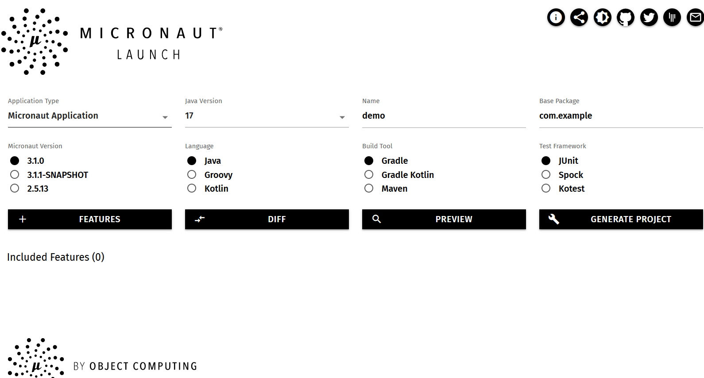

# Generate a Project Skeleton

Similar to [Spring Initializr]( https://start.spring.io), Micronaut provides an online service named **Launch** to generate a project skeleton for you.

Alternatively, Micronaut provides a command line. You can use it to generate a new project from the existing templates.

## Micronaut Launch

Open your browser, go to [Micronaut Launch](https://micronaut.io/launch/), you will see the following screen.



In the **Application Type** field, there are some options available in the dropdown menu, including **Micronaut Application**, **Command Line Application**, **gRPC Application**, **Funcation Application for serverless**, **Message-Driven Application**. For different purpose, you can choose one as template to generate the project skeleton. If you want to create a general web application, a RESTful API backend application, or a Microservice component, use the default **Micronaut Application**.

In the **Java version** field, it is highly recommended to choose the latest LTS version **17**.  

If you want to customize the project artifact name and base package name, alter the value in the **Name** and **Package Name**.

Next, select the **Micronaut Version**(the latest version is recommended) and your favorite **Language**, **Build Tools** and **Test framework**.

Click the **Features** button, in the popup panel, it lists all Micronaut integrated liraries/frameworks, choose those that you want to add to this project. 

Before downloading the generated archive, click the **PREVIEW** button to preview the file structure in a popup window.

Finally, hit the **GENERATE PROJECT** button to produce the project files into an archive for download.

Extract the project files into your local disk, and import the files into your IDE.  


## Micronaut CLI

You can also create a Micronaut project using Micronaut CLI, check [Micronaut Starter documentation](https://micronaut-projects.github.io/micronaut-starter/latest/guide/#installation) for details.

> Under Windows system, it is better to [install Cygwin](https://cygwin.com/install.html) to get Linux Bash like command experince.

Firstly install [SDKMan](https://sdkman.io/) which is a popular software management tool. 

Open your teminal, and run the following command to install a copy SDKMan automaticially.

```bash 
$ curl -s "https://get.sdkman.io" | bash
```

After it is installed successfully, run this command to initialize SDKMan configuration.

```bash
$ source "$HOME/.sdkman/bin/sdkman-init.sh"
```

Verify the SDKMan installation.

```bash
$ sdk version

SDKMAN 5.12.4
```

Next install Micronaut CLI from SDKMan reposiory.

```bash 
$ sdk install micronaut
```

After it is completed, verify the installation.

```bash 
$ mn -V
Micronaut Version: 3.1.0
```

Get all options of `mn` command.

```bash 
$mn --help
Usage: mn [-hvVx] [COMMAND]
Micronaut CLI command line interface for generating projects and services.
Application generation commands are:

*  create-app NAME
*  create-cli-app NAME
*  create-function-app NAME
*  create-grpc-app NAME
*  create-messaging-app NAME

Options:
  -h, --help         Show this help message and exit.
  -v, --verbose      Create verbose output.
  -V, --version      Print version information and exit.
  -x, --stacktrace   Show full stack trace when exceptions occur.

Commands:
  create-app            Creates an application
  create-cli-app        Creates a CLI application
  create-function-app   Creates a Cloud Function
  create-grpc-app       Creates a gRPC application
  create-messaging-app  Creates a messaging application

```

The *Commands* options is similar to the **Application Type** options in the **Micronaut Lauch** page.

Try to create a new proejct using the `mn` command.

```bash
$ mn create-app demo -b gradle -f lombok,postgres,data-jpa,hibernate-jpa,testcontainers -l java -t=junit

| Application created at C:\tools\cygwin\home\hantsy\demo
```

The generated project files are located in the demo folder. The fiels are almost same to the ones generated by the Micronaut Lauch page.

You can use `mn create-app --help` to get the option details of the `create-app` command.

## Exploring project structure

Let's have a look at the files in the project.

```bash
.
├── build.gradle
├── gradle
│   └── wrapper
│       ├── gradle-wrapper.jar
│       └── gradle-wrapper.properties
├── gradle.properties
├── gradlew
├── gradlew.bat
├── micronaut-cli.yml
├── settings.gradle
└── src
    ├── main
    │   ├── java
    │   │   └── com
    │   │       └── example
    │   │           └── Application.java
    │   └── resources
    │       ├── application.yml
    │       └── logback.xml
    └── test
        ├── java
        │   └── com
        │       └── example
        │           └── DemoTest.java
        └── resources
            ├── application-test.yml
            └── logback-test.xml
```

Besides Gradle build scripts related resources, it is similar to the Spring Boot project structure. 

* The `Application` is the entry class of the application.
* The *src/main/resources/application.yml* is the application configuration.
* The *src/main/resources/logback.xml*  is logging configuration, by default Micronaut uses Logback as logging framework.
* The `DemoTest` is an test example of using `@MicronautTest`. 
* Under the *src/test/resources* folder, there are some configuration resources for testing.

Let's have a look at *build.gradle*.

It uses `com.github.johnrengelman.shadow` to package the application into a jar archive.

The `micronaut` plugin handles the dependency injection at compile time via Java Compiler Annotation Processors. This plugin also includes other tasks, such building application into Docker image and GraalVM native image.

